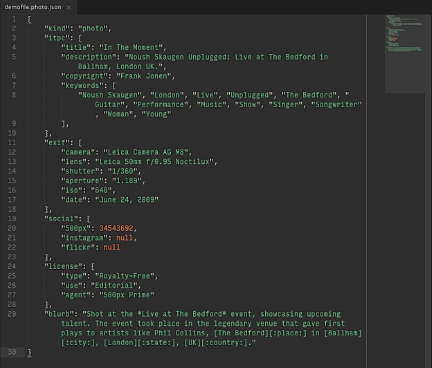
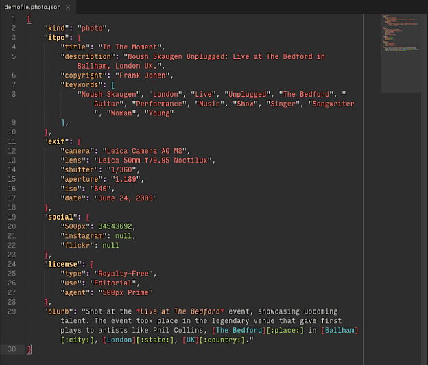

# 

## Fork Note
Looks like the original author deleted their repo, this is currently a backup copy for myself, the rest of this README is from the original...

#### Dedicated JSON environment for Sublime Text (2 and 3)

---

### What does it do?
*Vorhees* is a new syntax description for JSON files alongside your existing one, so you can always toggle between them, conflict-free.

I created *Vorhees* while designing a meta-data driven CMS. The available options soon made me dizzy while drafting data structures. It ceased to be healthy rather quickly as there were too few visual cues for telling individual pieces apart in a huge volume at a glance.

 
> Plain SublimeText JSON rendering

---

> Sublime Text with Vorhees

### Why start from scratch?
Sublime Text comes with a built-in JSON syntax highlighter, so why make a new one, aren’t color-schemes sufficient? 

> **A:** The issue with a color-scheme alone lies within the language description provided. In short, if the object picker is too generic, the scheme can’t do much to fix that. So I started a new one to slice through that, piece by piece, Crystal Lake style.

### Extras
*Vorhees* comes with very basic [Markdown](http://en.wikipedia.org/wiki/Markdown) support within JSON strings. There is also a `custom` section where you can place your own stuff without messing up existing scripts.
